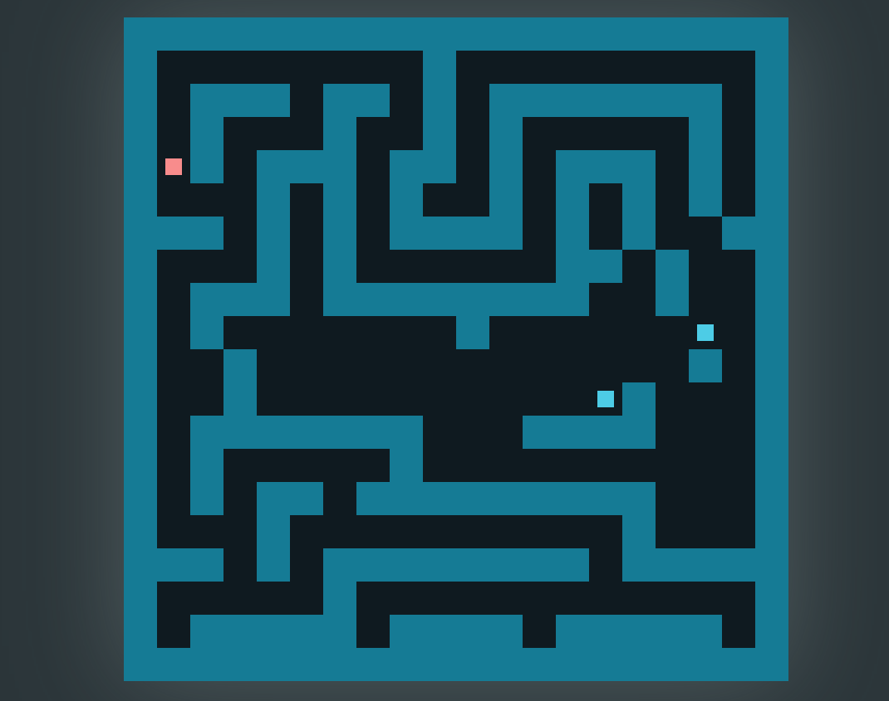

# Javascript - Oyun

## OYUN HAKKINDA 

Bind, HTML5 ve JavaScript kullanılarak geliştirilen 2D bir bulmaca–platform oyunudur. Oyuncu, kırmızı kare karakteri kontrol ederek engellerle dolu bir haritada ilerler ve her bölümdeki beyaz portala ulaşmaya çalışır. İlerleyen bölümlerde mavi kutular devreye girer; bu kutular toplanmadan portal aktif hale gelmez. Oyun, oyuncudan hem dikkatli bir rota planlaması hem de zamanlamalı hareketler bekler. Minimalist tasarımı ve akıcı mekanikleriyle, basit ama düşündüren bir oyun deneyimi sunar.
Oyun 5 bölümden oluşuyor. Yön tuşları ve ( w a s d ) tuşları ile kırmızı kare yönlendirilebilir. Oyuncu bölümü geçemez ve tekrar başlamak isterse R tuşu ile restart atabilir.

## OYUN İÇİNDEN FOTOĞRAFLAR 

## OYUNU OYNAMAK İÇİN
Oyunu oynamak için index.html dosyasını web tarayıcınızda çalıştırmanız yeterli.

## OYUNUN AÇIKLAMASI İÇİN YOUTUBE LİNKİ
https://www.youtube.com/watch?v=wzkx_ZFuXSQ
